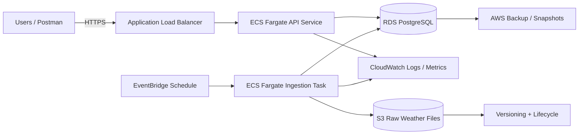

# Weather Platform Foundation

Production-grade FastAPI platform for weather ingestion, historical observation storage, and yearly aggregation.

## Overview

The application uses clean architecture, a repository layer, PostgreSQL, Alembic migrations, and scheduled ingestion to keep yearly statistics synchronized with raw weather observations.

## Data Models

### `WeatherObservation`

Represents one daily station observation.

- `id`: primary key
- `station_id`: NOAA station identifier
- `observation_date`: observation date
- `max_temp_c`: daily maximum temperature in Celsius
- `min_temp_c`: daily minimum temperature in Celsius
- `precipitation_cm`: daily precipitation in centimeters
- `source_file`: source file name for lineage
- `created_at`: insert timestamp

### `WeatherYearlyStat`

Represents one yearly aggregate per station.

- `id`: primary key
- `station_id`: NOAA station identifier
- `year`: aggregate year
- `avg_max_temp_c`: yearly average maximum temperature
- `avg_min_temp_c`: yearly average minimum temperature
- `total_precipitation_cm`: yearly precipitation total
- `observation_count`: number of observations included in the aggregate
- `created_at`: insert timestamp

### Request and response schemas

- `WeatherObservationCreate` and `WeatherObservationRead`
- `WeatherYearlyStatCreate` and `WeatherYearlyStatRead`
- `PaginatedWeatherObservationRead`
- `PaginatedWeatherYearlyStatRead`
- `HTTPErrorResponse`, `ValidationErrorResponse`

## High-Level Diagram



## Repository Structure

- `src/weather_platform/api` - API routers and dependencies
- `src/weather_platform/services` - application services
- `src/weather_platform/repositories` - persistence abstractions and SQLAlchemy implementations
- `src/weather_platform/models` - SQLAlchemy ORM models
- `src/weather_platform/schemas` - Pydantic DTOs
- `src/weather_platform/ingestion` - ingestion orchestration
- `src/weather_platform/config` - settings and database wiring
- `src/weather_platform/utils` - shared utilities
- `migrations` - Alembic environment and revisions
- `tests` - unit and integration tests

## Setup and Execution

### Local setup

```powershell
copy .env.example .env
make install
```

### Run database migrations

```powershell
make migrate
```

### Run ingestion

Process all weather files from `wx_data` into the configured PostgreSQL database:

```powershell
make ingest
```

Or run the script directly:

```powershell
.venv\Scripts\python.exe scripts/process_wx_data.py
```

### Run the API locally

```powershell
make run
```

Or run directly:

```powershell
.venv\Scripts\python.exe -m uvicorn weather_platform.main:app --reload
```

### Run with Docker Compose

```powershell
docker compose up --build
```

This starts PostgreSQL and the API container. The compose file overrides the API database URL so the container connects to the internal `db` host.

## API Endpoints

Base path: `/api/v1/weather`

### Observations

- `POST /observations` - Create or update a daily observation
- `GET /observations/{station_id}/{observation_date}` - Retrieve one observation
- `GET /observations` - Query observations with pagination and filters

Query parameters for `GET /observations`:

- `skip`: pagination offset
- `limit`: page size, capped at 1000
- `station_id`: optional station filter
- `start_date`: optional inclusive lower bound
- `end_date`: optional inclusive upper bound

### Yearly statistics

- `POST /yearly-stats` - Create or update a yearly aggregate
- `GET /yearly-stats/{station_id}` - List yearly aggregates for one station
- `GET /stats` - Query yearly stats with pagination and filters

Query parameters for `GET /stats`:

- `skip`: pagination offset
- `limit`: page size, capped at 1000
- `station_id`: optional station filter
- `start_year`: optional inclusive lower bound
- `end_year`: optional inclusive upper bound

### Common response codes

- `200` - Successful retrieval
- `201` - Successful create or idempotent upsert
- `404` - Observation not found
- `422` - Validation error
- `500` - Internal error

### Useful local URLs

- `http://localhost:8000/docs`
- `http://localhost:8000/redoc`
- `http://localhost:8000/api/v1/weather/observations?skip=0&limit=100`

## AWS Deployment

### Target services

- **ALB** for public API traffic
- **Amazon ECS** (Fargate launch type) for FastAPI service
- **EventBridge** → ECS Fargate task for scheduled ingestion
- **RDS PostgreSQL** (Multi-AZ) for transactional storage
- **S3** for raw weather data and retention
- **CloudWatch** for logs, metrics, alarms, and dashboards
- **AWS Secrets Manager** for secure configuration (DB creds, API keys)

### Infrastructure recommendations

- Put ALB in public subnets and application/database workloads in private subnets.
- Use a separate ECS task definition for ingestion so batch failures do not affect the API.
- Store secrets in AWS Secrets Manager or SSM Parameter Store.
- Enable RDS backups, Multi-AZ, and KMS encryption.
- Enable S3 versioning and lifecycle policies for raw file retention.

### Deployment flow

1. Build and test the application in GitHub Actions.
2. Build a Docker image and push it to ECR.
3. Deploy to staging ECS.
4. Run smoke tests against staging.
5. Approve and deploy the same image tag to production ECS.
6. Trigger ingestion on schedule through EventBridge.

### Failure resilience

- Use idempotent observation upserts.
- Recompute yearly stats after ingestion so derived data stays current.
- Configure ECS health checks and automatic task replacement.
- Use CloudWatch alarms for API errors, task restarts, and ingestion failures.
- Keep raw input files in S3 so ingestion can be replayed.

## Local Workflow

```powershell
copy .env.example .env
make install
make migrate
make ingest
make run
```
